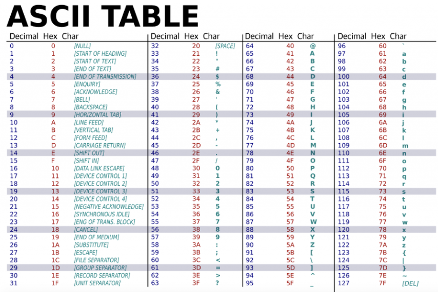

# TIL-terminology

> 오늘 배운 IT 관련 용어를 정리한다.

## Machine Learning 관련 용어
> 머신러닝 관련 용어들을(method, platform 등) 정리 한다.

#### 1. ONNX

: Open Neural Network Exchange 의 줄임말로 Tensorflow, Pytorch와 같이 서로 **`다른 DNN 프레임워크 환경에서 만들어진 모델들을 호환`**되게 사용되도록 만들어진 **`공유 플랫폼`**이다. 

예를 들어, Tensorflow에서 만든 모델을 ONXX 그래프로 export하고 PyTorch에서 그 모델을 import하여 사용이 가능하다.  ONXX는 크게  두가지의 장점을 지닌다.

* Framework Interoperability

  특정환경에서 생성된 모델을 다른 환경에서 자유롭게 import 할 수 있다는것이 최대 장점이다.

  Tensorflow에서 빠르게 학습 시킨 뒤 모바일로 옮겨서 사용하는 방식도 가능하다.

* Shared Optimization

  하드웨어 제조업체(HW vendor)의 입장으로 ONNX와 같은 프레임워크 간 공유되는 포맷이 존재하면, HW 설계시 ONXX representation을 기준으로 최적화 하면 되기 때문에 효율적이다. (예를 들어 ONXX라는 합의된 DNN 모델 포맷이 존재한다고 생각하면 된다.)

#### 참고 사이트

####  [onnx github tutorials](github.com/onnx/tutorials)

## 통신 관련 용어

> 프로토콜 등의 관련 용어들을 정리한다.

#### 1. SSH

: Secure Shell Protocal의 줄임말이다.  **`네트워크 프로토콜`**  중 하로 컴퓨터와 컴퓨터가 인터넷과 같은 **`Public Network를 통해 서로 통신할 때 보안적으로 안전`**하게 통신하기 위해 사용하는 **`프로토콜`**이다.

대포적 사용의 예

* 데이터 전송 

* 원격 제어

## 파일 확장자 용어

> 새로 배운 파일 확장자 용어들을 정리한다.

#### 1. PPK 파일

: PuTTY Private Key로 PuTTY를 이용해 아마존 AWS 관련한 것들을 사용하기 위해 필요한 파일이다.

## 데이터 베이스 용어

> DB 관련 용어들을 정리한다.

#### 1. BLOB

: Binary Large Object의 줄임말로 **데이터베이스 관리 시스템의 하나의 엔티티로** 저장하는 이진 데이터의 모임이다. 영어 단어를 보면 Large Object를 문자 그대로 큰 객체로 주로 이미지, 비디오, 사운드 등과 같은 멀티 미디어를 binary 형태로 저장할 것이라는것을 추축할 수 있다.

## 파이썬 용어 정리

> python 관련 용어들을 정리한다.

#### 1.Identifier

: 변수의 이름이 중복 되지 않게 다른것과 구분되게 고유한 이름을 붙인 것을 명칭(Identifier)  이라고 한다.

#### 2. Free Format

: 프리포맷,  C와 자바는  {} 괄호의 짝만 맞다면 코드를 한 줄에 쓰건 여러 줄에 나누던 상관 안한다.

이 때 소스의 형식에 특별한 제약이 없는 이런 방식을 프리포맷(Free Format) 이라 한다.

파이썬의 경우 **프리포맷이** **아니며** `개행과 들여쓰기를 규칙에 맞게 써야 한다.` 

## 문자열 인코딩 종류

> 문자열 인코딩 종류를 정리한다.

#### 1. 아스키(ASCII)코드

: American Standard Code Information Interchange의 줄임말로, 1960년대 미국에서 정의한 표준화한 부호체계이다.

1바이트(byte) = 8비트(bit)은 2의 8승인 256개의 고유한 값을 저장할 수있다.

아스키 코드의 경우 7비트만 활용한다. 즉 128개의 고유값을 사용한다. 이는 1비트를 **통신** **에러** **검출**을 위해 사용하기 때문이다.

(0~32, 127 : 인쇄와 제어용 용어, 33~126 : 숫자, 알파벳, 특수기호)

#### 2. ANSI 코드

: American National Standards Institute 8비트로 아스키코드를 확장한 코드이다.

아스키 코드에서 1비트 늘어났기 때문에 기존 아스키 코드보다 128개를 더 사용가능 하다.

이때, 1바이트만으로 표현되는 경우를 SBCS(Single Byte Character Set)이라고 한다.

반대의 경우는 MBCS(Multi-Byte Character Set)이라고 한다.

#### 3. EUC-KR

: Extended Unix Code-Korea, 한글 지원을 위해 UNIX 계열에서 나온 완성형 코드 조합이다. 참고로 2bytes 이다.

완성형 코드란 문자 하나하나마다 코드 번호를 부여한 것이다.

반대 개념으로 조합형 코드는 한글의 자음과 모음 각각에 코드 번호를 부여한 후  초성, 중성, 종성을 조합해 하나의 문자를 나타내는 방식을 말한다.

**EUC-KR**은 **ANSI**를 한국에서 확장한 것으로 외국에서는 지원이 잘 안된다.

#### 4. CP949

: Code Page949, 한글 지원을 위해 Windows 계열에서 나올 확장 완성형 코드 조합이다.

MS사에서 **EUC-KR**( 2-bytes) 의 한계 때문에 이를 개선하기 위해 확장해 만든것 이다. 949는 페이지 번호를 의미하며 한국을 의미한다. 참고로 일본어는 CP932, 중국어 간체는 CP936이다.

기본적으로 EUC-KR과 호환 되며, MS사에서 만들어 져서 MS949라고도 부른다.

#### 5. UTF-8(Universal Coded Character Set +Transformation Format-8-bit) 

: 유니코드를 위한 가변 길이 문자 인코딩(멀티바이트) 방식 중 하나로 ANSI의 단점을 보완하기 위해 만들어 졌다.

**ANSI**는 다국어 지원을 위해 CodePage 정보를 미리 알고 있어야 한다. **UTF-8**은 멀티바이트 개념을 사용하여 하나의 Character Set에 거의 모든 문자를 넣었다. 

여기서 멀티바이트란 문자에 따라 글자 크기를 가변으로 변경해 사용하는 것을 말한다. ANSI는 고정바이트(1바이트) 형태로 최대 256자 까지만 표현 가능하나 UTF-8은 멀티바이트(1~4bytes)로 최대 1,112,064자 까지 표현 가능하다. 영어인 경우 ASCII 코드값으로 ANSI와 동일해 1byte만 사용한다.

중동지역이나 많은 유럽 언어가 2bytes를 사용하고 아시아권 언어는 3bytes 이상을 사용한다.

UTF-8은 매우 일반적인 인코딩 방식이지만 3bytes 이상의 문자를 사용할 경우 비효율적일 수 있다.  

#### 6. UTF-16

: 16bit 기반의 UTF-8의 변형이다. 한글의 경우 UTF-8로 3bytes가 필요한데, UTF-16으로 저장하면 2bytes만 사용해 용량의 이점이 있다. 

그러나 2bytes 이상을 사용할 경우가 있어 용량의 이점이 좋다고 보긴 어렵다.

엔디안(Ebduab) 처리를 고려함에 따라 복잡성 증대나 **ANSI**와 호환이 안되는 단점이 있다.

#### 5. 유니코드

: 아스키 코드만으로 다른 언어들을 표현할 수 없기 때문에 2바이트(65536개)의 유니코드가 등장했다.

유니코드 3.0버전까지는 2바이트 영역을 기본다중언어판(BMP, Basic Multilingual Plane)이라 불렀다.

그러나 65536개로 이세상의 모든 문자를 담을 수 없어 유니코드 3.0부터 보충언어판(Supplementary Plane)을 정의했다.

주의해야 할 점은 유니코드는 `인코딩`이 아니다. 유니코드는 전세계 거의 모든 문자를 2bytes 숫자로 1:1 mapping 하는 방식을 말한다. 

유니코드를 표현하는 여러가지 인코딩 방식들이 존재하는데 UTF-8, UTF-16등이 인코딩이 이에 해당한다.

Windows vista 이상에서는 유니코드를 UTF-16으로 인코딩한다.

## 정리할 내용

* backporting

* 카멜표기법, 뱀표기법

* 디코딩, 인코딩

* Endian